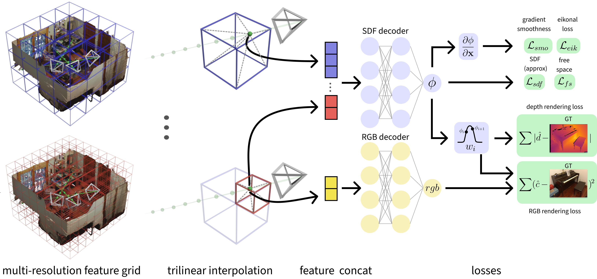

# GO-Surf: Neural Feature Grid Optimization for Fast, High-Fidelity RGB-D Surface Reconstruction
### [Project Page](https://jingwenwang95.github.io/go_surf/) | [Video](https://youtu.be/6d90HEpXNMc?t=3) | [Video(Bilibili)](https://www.bilibili.com/video/BV1g3411374W?share_source=copy_web) | [Paper](https://arxiv.org/abs/2206.14735)

> GO-Surf: Neural Feature Grid Optimization for Fast, High-Fidelity RGB-D Surface Reconstruction <br />
> [Jingwen Wang](https://jingwenwang95.github.io/), [Tymoteusz Bleja](https://github.com/tymoteuszb), [Lourdes Agapito](http://www0.cs.ucl.ac.uk/staff/L.Agapito/) <br />
> 3DV 2022 (Oral)

<p align="center">
  
</p>

This repository contains the code for GO-Surf, a direct feature grid optimization method for accurate and fast surface reconstruction from RGB-D sequences.

# Method Overview

GO-Surf uses multi-level feature grids and two shallow MLP decoders. Given a sample point along a ray, each grid is queried via tri-linear interpolation. Multi-level features are concatenated and decoded into SDF, and used to compute the sample weight. Color is decoded separately from the finest grid. Loss terms are applied to SDF values, and rendered depth and color. The gradient of the SDF is calculated at each query point and used for Eikonal and smoothness regularization.

<p align="center">
  
</p>

# Quick Start

## 1. Installation

### Clone GO-Surf repo

```
git clone https://github.com/JingwenWang95/go-surf.git
cd go-surf
```

### Create environment

The code is tested with Python 3.9 and PyTorch 1.11 with CUDA 11.3. GO-Surf requires [smooth_sampler](https://github.com/tymoteuszb/smooth-sampler). Also the following packages are required:

<details>
  <summary> Dependencies (click to expand) </summary>

  * torch
  * pytorch3d
  * scikit-image
  * trimesh
  * open3d
  * imageio
  * matplotlib
  * configargparse
  * tensorboard
  * opencv-python
  * opencv-contrib-python

</details>

You can create an anaconda environment with those requirements by running:

```
conda env create -f environment.yml
conda activate go_surf
```

### Compile C++ extensions
Then install the external Marching Cubes dependency in the same environment:
```
# compile marching cubes
cd external/NumpyMarchingCubes
python setup.py install
```

## 2. Dataset

### Synthetic Dataset
We use the synthetic dataset from [NeuralRGB-D](https://github.com/dazinovic/neural-rgbd-surface-reconstruction) which contains 10 synthetic sequences with GT meshes and camera poses. You can download it from [here](). You can find the original link in NeuralRGB-D's Github repo from [here](https://github.com/dazinovic/neural-rgbd-surface-reconstruction#dataset).

The data of each scene is organised as follows:
```
<scene_name>            # args.scene in command line args
├── depth               # raw (real data) or ground truth (synthetic data) depth images (optional)
    ├── depth0.png     
    ├── depth1.png
    ├── depth2.png
    ...
├── depth_filtered      # filtered depth images
    ├── depth0.png     
    ├── depth1.png
    ├── depth2.png
    ...
├── depth_with_noise    # depth images with synthetic noise and artifacts (optional)
    ├── depth0.png     
    ├── depth1.png
    ├── depth2.png
    ...
├── images              # RGB images
    ├── img0.png     
    ├── img1.png
    ├── img2.png
    ...
├── focal.txt           # focal length
├── poses.txt           # ground truth poses (optional)
├── trainval_poses.txt  # camera poses used for optimization
├── gt_mesh.ply         # ground-truth mesh
├── gt_mesh_culled.ply  # culled ground-truth mesh for evaluation
```
Note that `poses.txt` contains gt poses defined in the same world coordinate as gt mesh, while `trainval_poses.txt` contains initial camera poses estimated by BundleFusion which are aligned with the first camera pose. In our dataloader we pre-align all the BundleFusion poses to the world coordinate for simplicity. Also note that both poses follow the OpenGL convention (right-upward-backward).

### ScanNet Dataset
We also tested our code on real-world sequences from ScanNet. You can download the sequences following the instructions on their [website](http://www.scan-net.org/).

Don't forget to change the `datasets_dir` in the config files to the dataset root directory after downloading the datasets!

## 3. Run

You can start training by running:
```
python train.py --scene grey_white_room  --exp_name test
```
Note that `scene` must correspond to the config files defined under `configs/`. For the list of scenes you can refer to (here)[]. After training, the log files and checkpoints will be saved under `logs/${scene}/${exp_name}`

To extract the mesh of trained scene, simply run:
```
python reconstruct.py --scene grey_white_room  --exp_name test
```
The extracted mesh will be saved as `logs/${scene}/${exp_name}/mesh/${scene}.ply`

For evaluation, run:
```
python eval_mesh.py --scene grey_white_room  --exp_name test --n_iters 10000 --remove_missing_depth
```
which will first re-align and cull the original mesh, and then do the evaluation. Intermediate meshes and evaluation results are saved under `logs/${scene}/${exp_name}/mesh/`

# Citation
If you use this code in your research, please consider citing:

```
@inproceedings{wang2022go-surf,
  author={Wang, Jingwen and Bleja, Tymoteusz and Agapito, Lourdes},
  booktitle={2022 International Conference on 3D Vision (3DV)},
  title={GO-Surf: Neural Feature Grid Optimization for Fast, High-Fidelity RGB-D Surface
  Reconstruction},
  year={2022},
  organization={IEEE}
}
```

# Acknowledgement
Some code snippets are borrowed from [neurecon](https://github.com/ventusff/neurecon) and [NeRF-pytorch](https://github.com/yenchenlin/nerf-pytorch). The Marching Cubes implementation was from [NeuralRGB-D](https://github.com/dazinovic/neural-rgbd-surface-reconstruction). Special thanks to [Dejan Azinović](https://niessnerlab.org/members/dejan_azinovic/profile.html) for providing additional details on culling and evaluation scripts!

